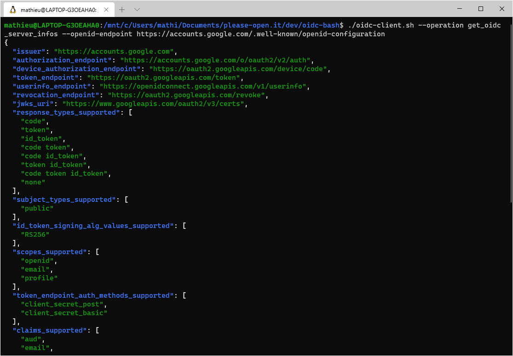
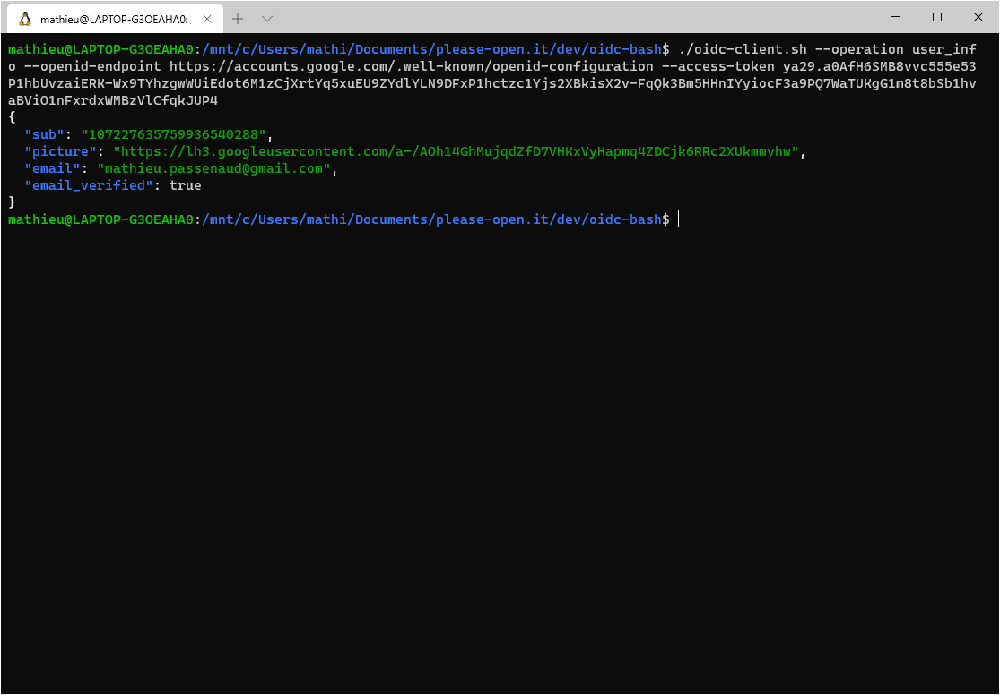

# please-open.it bash oauth2/openid connect wrapper

## Purpose
[please-open.it](https://please-open.it) specializes in authentication and web security, and provides Keycloak as a service.

This bash script is an oauth2 wrapper. You can make any authentication request from command line with the right arguments.

Supported operations are : 

- get oidc server infos
- client credentials
- implicit flow
- authorization code flow
- resource owner password
- auth code exchange
- token exchange
- refresh token
- end session
- token introspection
- user infos
- device code
- poll token

Use it as a guide for oauth2/openid connect discovery or in any testing/integration process. Script is totally stateless, save the output of a command in variables to reuse tokens.

## Install

You need curl, jq and netcat installed.

Note : on Debian, install netcat-openbsd version

```
apt-get install netcat-openbsd
```

## Quick tour Using Google

### Discovery document

Google is an OpenIdConnect provider, you can get the [discovery document](https://developers.google.com/identity/protocols/oauth2/openid-connect#discovery) at https://accounts.google.com/.well-known/openid-configuration

```
./oidc-client.sh --operation get_oidc_server_infos --openid-endpoint https://accounts.google.com/.well-known/openid-configuration
```



### Get a new token

*Using authorization_code_grant process, a standard for the web supported by all providers, you can get a new token from an authorization_code. To get a new authorization_code, 

```
./oidc-client.sh --operation authorization_code_grant --client-id 947227895516-68tp60nti613r42u41bch5vesr5iqpbi.apps.googleusercontent.com --openid-endpoint https://accounts.google.com/.well-known/openid-configuration --redirect-uri http://127.0.0.1:8080 --scope email
```

Then the console shows : 

```
OPEN THIS URI IN YOUR WEB BROWSER
https://accounts.google.com/o/oauth2/v2/auth?client_id=947227895516-68tp60nti613r42u41bch5vesr5iqpbi.apps.googleusercontent.com&scope=email&response_type=code&response_mode=fragment&redirect_uri=http://127.0.0.1:8080
-- LISTENING ON PORT 8080 FOR A REDIRECT
```

Open your web browser and paste the URI shown in the console. You will have a login screen then a consent screen. Afterthat, redirect process will show a page from 127.0.0.1:8080 with all given data. Get your authorization code.

Second step is exchanging an authorization_code for a token. The operation "auth_code" is designed for : 

```
./oidc-client.sh --operation auth_code --client-id 947227895516-68tp60nti613r42u41bch5vesr5iqpbi.apps.googleusercontent.com --client-secret ****************** --openid-endpoint https://accounts.google.com/.well-known/openid-configuration --redirect-uri http://127.0.0.1:8080 --authorization-code 4/0AH1T7cXxcNot62nDDUspvbINZ6vP3Qk9oEiy6xhJmuRbIIdJw65LdOc2QPWKO8qaHTQ67g1qg96mjS5R9dWVFs
```


### User infos

using the access_token we got previously : 



## Build for Keycloak ?

Of course ! Keycloak has its own discovery document (for a realm) with the "OpenID Endpoint Configuration" link. Keycloak supports all operations of this bash script, please refer to the documentation links for each operation below.

Feel free to test it with a realm you can get at [https://realms.please-open.it](https://realms.please-open.it).

## Filter

Each operation output some formatted JSON code. By using --field argument, you can filter the output with JQ [grammar](https://jqplay.org/).

## Operations

### get_oidc_server_infos

[https://openid.net/specs/openid-connect-discovery-1_0.html](https://openid.net/specs/openid-connect-discovery-1_0.html)

Get oauth2 and openid connect endpoint locations using the discovery document.

--openid-endpoint

### client_credentials

[https://www.mathieupassenaud.fr/oauth-backend/](https://www.mathieupassenaud.fr/oauth-backend/)

Perform client_credentials authentication request.

--openid-endpoint OR --token-endpoint

--client-id

--client-secret

### resource_owner_password_grant

[https://oauthlib.readthedocs.io/en/latest/oauth2/grants/password.html](https://oauthlib.readthedocs.io/en/latest/oauth2/grants/password.html)

Make an authentication request with client credentials and user credentials.

--openid-endpoint OR --token-endpoint

--client-id

--client-secret (optionnal in case of public client)

--username

--password

--scope

### end_session

Just log out the user by revoking tokens

--openid-endpoint OR --end-session-endpoint

--access-token

--refresh-token

--client-id

--client-secret (optionnal if client is public)

### refresh_token

Renew an access_token using a refresh_token

--openid-endpoint OR --token-endpoint

--client-id

--client-secret (optionnal if client is public)

--refresh-token

### token_exchange

[https://www.mathieupassenaud.fr/token-exchange-keycloak/](https://www.mathieupassenaud.fr/token-exchange-keycloak/)

Perform a token_exchange operation

--openid-endpoint OR --token-endpoint

--client-id

--client-secret

--access_token

--issuer

### implicit_grant

[https://docs.microsoft.com/en-us/azure/active-directory/develop/v2-oauth2-implicit-grant-flow](https://docs.microsoft.com/en-us/azure/active-directory/develop/v2-oauth2-implicit-grant-flow)

FOR LEGACY APPLICATIONS ONLY

Initiate a connection by showing an URL you have to open using your local web browser.

Then, a local web server (using netcat) will respond with a single page showing tokens returned by the authentication server in the redirect_uri.

By default, redirect URI has to be http://127.0.0.1:8080, you can have your own web server for this usage.

--openid-endpoint OR --authorization-endpoint

--client-id

--redirect-uri

--scope

### authorization_code_grant

[https://docs.microsoft.com/en-us/azure/active-directory/develop/v2-oauth2-auth-code-flow](https://docs.microsoft.com/en-us/azure/active-directory/develop/v2-oauth2-auth-code-flow)

Initiate a connection by showing an URL you have to open using your local web browser.

Then, a local web server (using netcat) will respond with a single page showing the authorization_code returned by the authentification server in the redirect_uri.

By default, redirect URI has to be http://127.0.0.1:8080, you can have your own web server for this usage.

--openid-endpoint OR --authorization-endpoint

--client-id

--redirect-uri

--scope

### auth_code

Change an authorization_code to a token

--openid-endpoint OR --token-endpoint

--client-id

--client-secret (optionnal for public clients)

--redirect-uri

### token_introspect

[https://www.oauth.com/oauth2-servers/token-introspection-endpoint/](https://www.oauth.com/oauth2-servers/token-introspection-endpoint/)

Get details about a token

--openid-endpoint OR --token-introspection-endpoint

--client-id

--client-secret

--access-token

### user_info

Get all user informations

--openid-endpoint OR --userinfo-endpoint

--access-token

### device_code

Initiate a device_code flow

--openid-endpoint OR --device-authorization-endpoint

--client-id

--client-secret

### poll_token

Get a token (poll operation, renew if necessary), IE for a device_code flow

--openid-endpoint OR --token-endpoint

--client-id

--client-secret

--device-code
